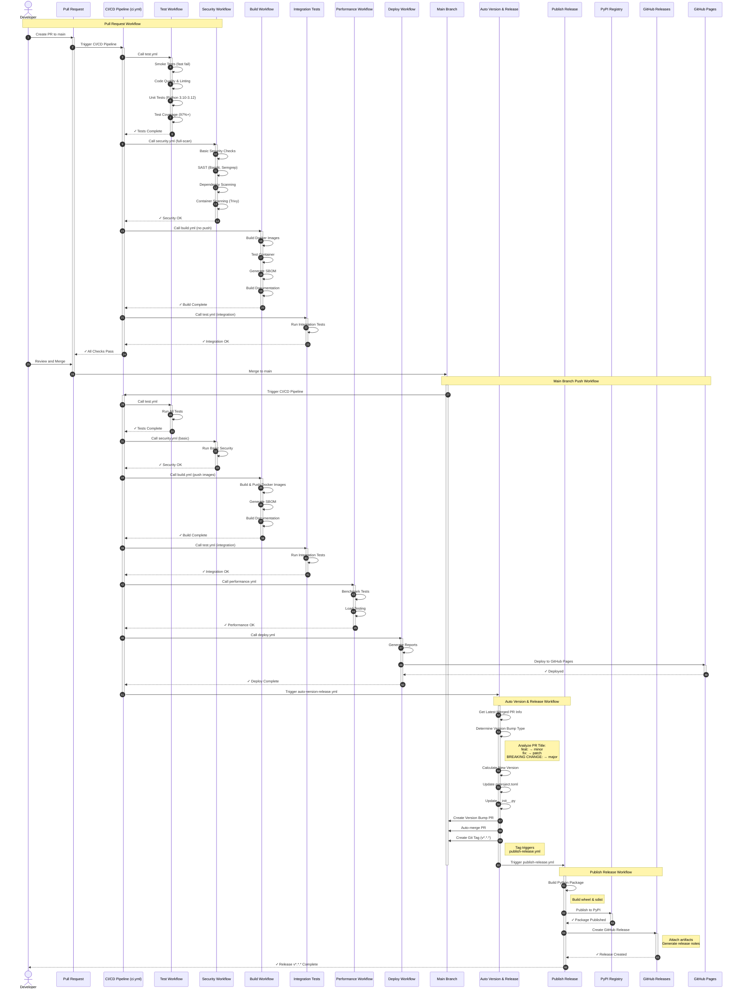
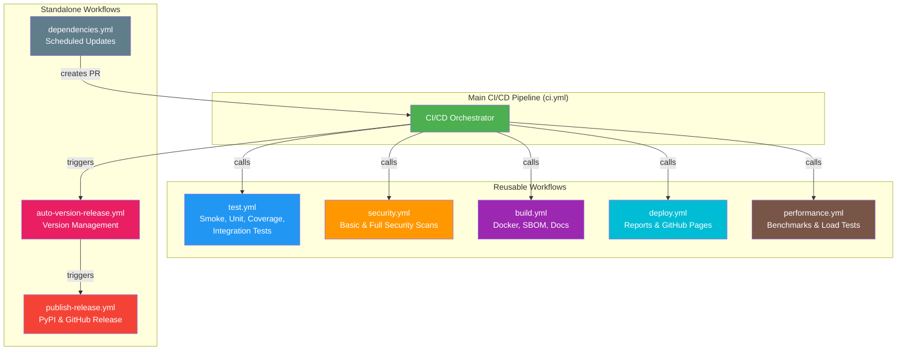

# Workflow Architecture Diagram

This document provides a comprehensive UML diagram showing all GitHub Actions workflows and their interactions in the refactored modular architecture.

## Overview

The CI/CD system has been refactored to use a **modular architecture** where the main `ci.yml` workflow orchestrates reusable workflow components:

- **ci.yml** - Main orchestrator that calls other workflows
- **test.yml** - Reusable test workflow (smoke, unit, integration, coverage)
- **security.yml** - Reusable security scanning workflow
- **build.yml** - Reusable build workflow (Docker, SBOM, documentation)
- **deploy.yml** - Reusable deployment workflow (reports, GitHub Pages)
- **performance.yml** - Reusable performance testing workflow
- **dependencies.yml** - Standalone scheduled dependency updates
- **auto-version-release.yml** - Standalone version management
- **publish-release.yml** - Standalone release publishing

## Workflow Flow Diagram



## Modular Workflow Architecture



## Workflow Descriptions

### Main CI/CD Pipeline (`ci.yml`)

**Purpose:** Orchestrator workflow that manages the entire CI/CD process by calling reusable workflows.

**Triggers:**
- Push to `main` branch
- Pull requests to `main`
- Tag pushes (`v*.*.*`)
- Manual dispatch

**Flow:**
1. **Test Phase** - Calls `test.yml` for smoke tests, code quality, unit tests, and coverage
2. **Security Phase** - Calls `security.yml` (full scan on PR, basic on main)
3. **Build Phase** - Calls `build.yml` (builds Docker images, SBOM, docs)
4. **Integration Phase** - Calls `test.yml` again with integration tests enabled
5. **Performance Phase** - Calls `performance.yml` (main branch only)
6. **Deploy Phase** - Calls `deploy.yml` (main branch only)
7. **Trigger Auto-Version** - Triggers `auto-version-release.yml` (main branch only)

**Benefits:**
- Simplified main workflow (120 lines vs 662 lines previously)
- Clear separation of concerns
- Easy to maintain and extend
- Consistent execution across all environments

### Reusable Workflow: Test (`test.yml`)

**Purpose:** Handles all testing phases including smoke tests, unit tests, coverage, and integration tests.

**Inputs:**
- `python-version` - Python version to use (default: '3.12')
- `run-integration` - Whether to run integration tests (default: false)

**Jobs:**
1. **Smoke Tests** - Quick validation (imports, syntax)
2. **Code Quality** - Ruff format check, linting, mypy type checking
3. **Unit Tests** - Multi-version Python testing (3.10, 3.11, 3.12)
4. **Coverage** - Test coverage with reports (target: 97%+)
5. **Integration Tests** - Tests against containerized API (when enabled)

**Called by:** `ci.yml` (twice - once for unit tests, once for integration)

### Reusable Workflow: Security (`security.yml`)

**Purpose:** Performs security scanning at different levels based on context (comprehensive on main/tags, basic on PRs).

**Inputs:**

- `python-version` - Python version to use (default: '3.12')
- `full-scan` - Whether to run comprehensive security scan (default: false)

**Jobs:**

1. **Basic Security Checks** - Bandit (hardcoded secrets), pip-audit, pip-licenses (always runs)
2. **SAST** - Static Application Security Testing (full scan only)
   - Bandit (code analysis & hardcoded secrets)
   - Semgrep (pattern-based security analysis)
3. **Dependency Vulnerabilities** - Full dependency scanning (full scan only)
   - Safety (known vulnerabilities database)
   - pip-audit (package auditing)
   - Dependency tree generation
4. **Container Security Scan** - Image & SBOM analysis (full scan only)
   - Trivy (container image vulnerabilities)
   - Grype (SBOM vulnerability analysis)

**Execution Strategy:**

- **Pull Requests:** Basic security checks only (Bandit + licenses) - fast feedback
- **Main Branch & Tags:** Full comprehensive security suite (all 6 tools) - complete validation

**Called by:** `ci.yml` (full scan on main/tags, basic on PR)

### Reusable Workflow: Build (`build.yml`)

**Purpose:** Builds Docker images, generates SBOM, and builds documentation.

**Inputs:**
- `python-version` - Python version to use (default: '3.12')
- `push-image` - Whether to push Docker image to registry (default: false)

**Jobs:**
1. **Docker Build** - Builds and optionally pushes container images
2. **SBOM** - Generates Software Bill of Materials
3. **Documentation** - Builds MkDocs documentation

**Called by:** `ci.yml` (pushes images on main/tags, only builds on PR)

### Reusable Workflow: Deploy (`deploy.yml`)

**Purpose:** Generates consolidated reports and deploys documentation to GitHub Pages.

**Inputs:**
- `python-version` - Python version to use (default: '3.12')

**Jobs:**
1. **Generate Reports** - Creates test, coverage, security, and performance reports
2. **Deploy Documentation** - Deploys to GitHub Pages (main branch only)

**Called by:** `ci.yml` (main branch only)

### Reusable Workflow: Performance (`performance.yml`)

**Purpose:** Runs performance benchmarks and load testing.

**Inputs:**
- `python-version` - Python version to use (default: '3.12')

**Jobs:**
1. **Load Test** - Locust-based load testing (20 concurrent users)
2. **Benchmark** - Performance baseline measurements

**Called by:** `ci.yml` (main branch only)

**Also triggers:** Independently on push/PR to performance-related files

### Standalone Workflow: Dependencies (`dependencies.yml`)

**Purpose:** Automated dependency updates on a weekly schedule.

**Triggers:**
- Weekly cron schedule (Mondays at 9:00 AM UTC)
- Manual dispatch

**Jobs:**
1. **Update Python Dependencies** - Updates pyproject.toml
2. **Update Frontend Dependencies** - Updates package.json
3. **Security Audit** - Runs security checks on dependencies

**Creates:** Pull request with dependency updates that triggers CI/CD

### Standalone Workflow: Auto Version & Release (`auto-version-release.yml`)

**Purpose:** Automatically manages version bumping based on conventional commits.

**Triggers:**
- Workflow dispatch from `ci.yml` (after successful main branch build)
- Manual dispatch

**Process:**
1. Analyzes merged PR title to determine version bump type:
   - `feat:`, `feature:` → **minor** version bump
   - `fix:`, `bugfix:`, `chore:`, `perf:`, `refactor:`, `docs:` → **patch** version bump
   - `breaking:`, `feat!:`, `BREAKING CHANGE:` → **major** version bump
2. Calculates new version
3. Updates `pyproject.toml` and `src/msn_weather_wrapper/__init__.py`
4. Creates version bump PR
5. Auto-merges the PR (if branch protection allows)
6. Creates git tag (format: `v*.*.*`)
7. Triggers `publish-release.yml`

### Standalone Workflow: Publish Release (`publish-release.yml`)

**Purpose:** Publishes releases to PyPI and GitHub Releases.

**Triggers:**
- Git tag push (pattern: `v*.*.*`)
- Manual dispatch with tag input

**Jobs:**
1. **Build Package** - Creates wheel and source distribution
2. **Publish to PyPI** - Uploads package to PyPI registry (using trusted publishing)
3. **Create GitHub Release** - Creates release with artifacts and generated notes

## Workflow Triggers Summary

| Workflow | PR | Push to Main | Tag Push | Manual | Cron | Called by ci.yml |
|----------|----|--------------|---------|---------|---------| -----------------|
| **ci.yml** (Main) | ✓ | ✓ | ✓ | ✓ | - | - |
| test.yml | - | - | - | - | - | ✓ |
| security.yml | - | - | - | - | - | ✓ |
| build.yml | - | - | - | - | - | ✓ |
| deploy.yml | - | - | - | - | - | ✓ |
| performance.yml | ✓ | ✓ | - | - | - | ✓ |
| dependencies.yml | - | - | - | ✓ | ✓ | - |
| auto-version-release.yml | - | - | - | ✓ | - | Triggered by ci.yml |
| publish-release.yml | - | - | ✓ | ✓ | - | Triggered by auto-version |

## Key Benefits of Refactored Architecture

### 1. Modularity
- **Separation of Concerns:** Each workflow has a single, well-defined purpose
- **Reusability:** Workflows can be called by multiple other workflows
- **Maintainability:** Changes are isolated to specific workflow files

### 2. Simplification
- **Main CI/CD:** Reduced from 662 lines to ~120 lines
- **Clear Flow:** Easy to understand the overall CI/CD process
- **Less Duplication:** Common logic is in reusable workflows

### 3. Flexibility
- **Configurable:** Workflows accept inputs for different scenarios
- **Conditional Execution:** Different behavior on PR vs main branch
- **Independent Triggers:** Some workflows can run standalone

### 4. Efficiency
- **Parallel Execution:** Independent workflows can run in parallel
- **Smart Scheduling:** Performance tests only on main, full security scan only on PR
- **Resource Optimization:** Only necessary steps run based on context

### 5. Testability
- **Isolated Testing:** Individual workflows can be tested independently
- **Manual Triggers:** All workflows support manual dispatch for testing
- **Clear Dependencies:** Easy to see what depends on what

## Environment Variables

All workflows use consistent environment configuration:

```yaml
env:
  PYTHON_VERSION: '3.12'
  NODE_VERSION: '20'
  REPORTS_DIR: 'docs/reports'
```

## Secrets Required

- `GITHUB_TOKEN` - Automatically provided by GitHub Actions
- No additional secrets required (PyPI uses OIDC trusted publishing)

## Cache Strategy

Workflows leverage GitHub Actions caching for:
- Python dependencies (pip cache via setup-python-env action)
- Node.js dependencies (npm cache)
- Docker layer caching (buildx cache)
- Build artifacts between jobs

## Migration from Old Architecture

The refactoring maintains 100% backward compatibility:

- ✅ All existing functionality preserved
- ✅ Same quality gates and checks
- ✅ Same deployment targets
- ✅ Same version management process
- ✅ Same security scanning coverage

**What changed:**
- Workflow organization (monolithic → modular)
- File structure (1 large file → 6 focused files)
- Maintainability (improved significantly)

**What stayed the same:**
- All test coverage requirements
- All security checks
- All build and deployment steps
- All triggers and automation
